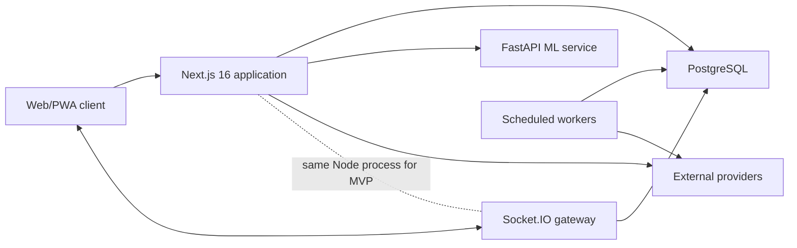

# 03. System Architecture

## 1. Architectural Decision

Use a modular monolith plus one ML service for MVP:

- Next.js 16.2.6 App Router: UI, authentication, route handlers, domain services, database access, payment webhooks.
- Custom Node HTTP server: hosts Next.js and Socket.IO.
- FastAPI: isolated numeric/ML inference endpoints.
- PostgreSQL: authoritative transactional datastore.
- Browser service worker: offline shell and active-trip cache.
- External providers: maps/places, weather, translation, payments, notifications, and optional OpenAI.

Do not add MongoDB, Redis, RabbitMQ, Kubernetes, or separate services until scale or reliability measurements justify them.



## 2. Layer Boundaries

### Presentation

`src/app`, `src/components`, `src/hooks`

- Pages compose features.
- Client components own browser interactions only.
- No direct database, secret, or payment-provider access.

### HTTP And Realtime Adapters

`src/app/api`, `server.ts`

- Authenticate.
- Validate request.
- Authorize resource.
- Call domain/service function.
- Map domain result to stable response.
- Do not contain duplicated business formulas.

### Domain

`src/lib`

- Matching, group rules, itinerary versioning, expense math, consent, emergency orchestration.
- Pure functions where possible.
- Money uses integer minor units or a decimal library.

### Integrations

`src/services`

- Provider-specific clients, timeouts, retries, circuit state, response normalization, and source metadata.
- Providers never leak their response shape into UI components.

### Persistence

`src/db`

- Drizzle schema, migrations, repositories, and transaction boundaries.
- Database constraints mirror domain invariants.

### ML

`python-service`

- Pydantic request/response models.
- Versioned inference metadata.
- Deterministic fallbacks are identified as heuristics.
- Training is outside the web request lifecycle.

## 3. Next.js 16 Rules

- Read the local guide in `node_modules/next/dist/docs/` before edits.
- Use `proxy.ts`; middleware terminology and file convention are deprecated.
- Proxy performs route redirection only. Sensitive APIs still call `auth()` and resource authorization.
- Dynamic route `params` are asynchronous and must be awaited.
- Route handlers use Web `Request`/`Response` or Next request/response APIs.
- Server Components fetch server-side data directly through domain/repository functions when practical; do not call the app's own HTTP endpoint from the server without a boundary reason.
- Client Components are limited to forms, sockets, maps, browser location, uploads, and interactive state.
- `loading.tsx`, `error.tsx`, and `not-found.tsx` are required for major route groups.
- Cache authenticated or rapidly changing data explicitly as no-store. Cache provider reference data with documented TTL and tags.
- A custom server removes some platform optimizations; deployment must use a persistent Node runtime, not a pure serverless target.

## 4. Request Pipeline

1. Correlation ID is accepted or generated.
2. Proxy redirects unauthenticated page navigation.
3. Route handler authenticates.
4. Zod validates path/query/body.
5. Authorization checks ownership/membership/role.
6. Domain service executes inside a transaction if multiple writes are related.
7. Audit event is recorded for sensitive actions.
8. Response uses the standard envelope.

Standard success:

```json
{"data": {}, "meta": {"requestId": "...", "source": "live", "generatedAt": "..."}}
```

Standard error:

```json
{"error": {"code": "GROUP_FULL", "message": "This group is already full.", "requestId": "...", "details": []}}
```

## 5. Realtime Architecture

Socket handshake must authenticate from the session cookie or a short-lived signed socket token. Client-supplied `userId` is never trusted.

Rooms:

- `user:{userId}`
- `group:{groupId}`
- `prematch:{chatId}`
- `trip:{tripId}`

For each event:

1. Validate payload.
2. Derive user from socket identity.
3. Authorize room/resource.
4. Persist durable writes.
5. Broadcast the persisted record and version.
6. Acknowledge with success or structured error.

Location events are ephemeral by default. The database stores sharing-session metadata and SOS snapshots, not a continuous location history unless the user explicitly opts in for a defined purpose.

## 6. Background Work

MVP jobs may run as separate Node processes using database-backed leases:

- Weather/traffic/event refresh for active trips every 15 minutes.
- Medication reminders every minute with idempotency key.
- Notification retries.
- Expired location-session cleanup.
- Provider cache cleanup.
- Data-retention/deletion tasks.

Do not run cron loops inside every horizontally scaled web instance without a distributed lease.

## 7. External Provider Strategy

Every provider client implements:

- 3-10 second timeout based on operation.
- Bounded retries only for transient/idempotent calls.
- Rate-limit awareness.
- Normalized domain response.
- Source, fetched-at, and confidence/verification metadata.
- Clearly labeled fallback.
- Health metric and error classification.

Fallback hierarchy:

- Places/maps: configured provider -> OpenStreetMap/Nominatim within usage policy -> unverified draft.
- Itinerary: configured LLM -> deterministic local template -> manual draft.
- Weather/traffic/events: live provider -> stale cache -> unavailable label. Never fabricate live conditions.
- Notifications: provider -> queued retry -> visible failure status.

## 8. Data And Caching

- PostgreSQL is the source of truth.
- In-process cache is allowed only for low-risk development/reference data.
- Provider cache belongs in PostgreSQL for a single-instance MVP.
- Redis becomes required before multi-instance Socket.IO, distributed rate limits, or high-volume provider caching.
- Cache keys include provider, locale, coordinates/query, and relevant filters.
- Medical plaintext is never cached.

## 9. Security Architecture

- Session cookies: secure, HTTP-only, same-site policy appropriate to OAuth.
- CSRF protection for state-changing browser requests according to Auth.js/Next.js guidance.
- Content Security Policy and restricted external image/connect domains.
- Rate limits for login, registration, invite join, chat, generation, uploads, SOS, and webhooks.
- Server-side MIME validation and object storage for avatars/receipts. Base64 blobs do not belong in the user table.
- Authenticated encryption for medical fields with per-record nonce and key version.
- Secrets supplied at runtime and rotated. No placeholder secret is accepted in production.
- Logs redact authorization headers, cookies, medical data, chat content by default, exact coordinates, and payment payloads.

## 10. Deployment Topology

### Local

Docker Compose:

- `web:3000`
- `ml-service:8000`
- `postgres:5432`

### Production MVP

- One or more persistent Node containers behind TLS load balancer.
- One FastAPI deployment.
- Managed PostgreSQL with encrypted storage, point-in-time recovery, and private networking.
- Object storage/CDN for avatars and receipts.
- Scheduled worker deployment.
- Provider secrets in a managed secret store.

Before scaling web above one instance, add sticky sessions or preferably Redis Socket.IO adapter plus shared rate limiting.

## 11. Observability

Required:

- `/api/health/live` process health.
- `/api/health/ready` database and required dependency readiness.
- FastAPI `/health`.
- Structured JSON logs with request ID, route, status, duration, user hash, and error code.
- Metrics: request count/latency/errors, socket connections/events/errors, provider latency/errors, generation duration, job lag, notification status.
- Audit events: login security events, consent change, medical read, group membership change, itinerary version, expense mutation, SOS, entitlement change, export/deletion.
- Error tracking with source maps and sensitive-data scrubbing.

## 12. Architecture Decision Records

Create ADRs for:

- Custom Socket.IO server.
- PostgreSQL-only MVP.
- Medical encryption scheme.
- Matching formula and fairness controls.
- LLM itinerary generation and verification.
- Realtime location retention.
- Payment entitlement source of truth.

