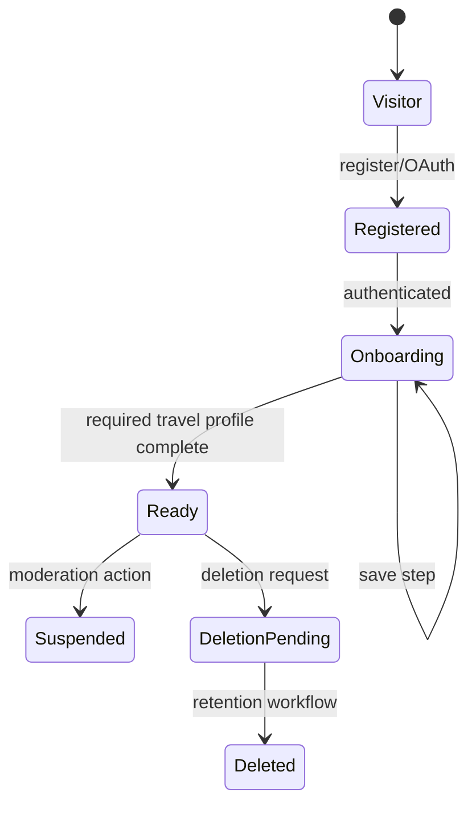
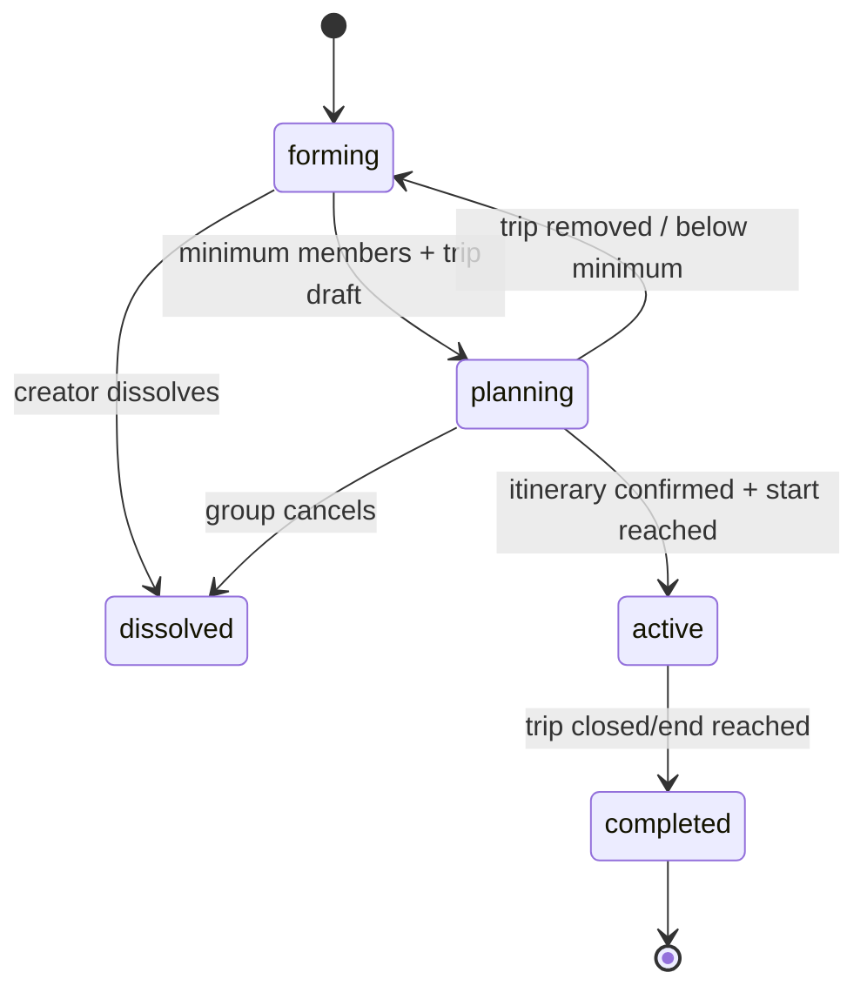
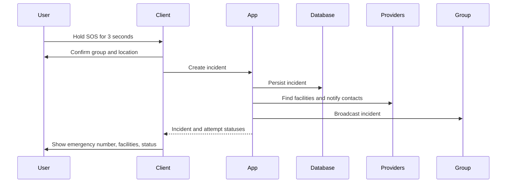

# 05. Workflows, AI, Safety, And Security

## 1. Account And Onboarding Workflow

Rules:

1. Normalize email and verify adult eligibility.
2. Create account and session.
3. Redirect to the first incomplete onboarding step.
4. Save each step idempotently.
5. Medical step is optional.
6. Review visibility and consent.
7. Mark onboarded and refresh session.
8. Route to dashboard.

## 2. Matching Workflow

1. Load the user's current profile and visibility settings.
2. Select eligible candidates: onboarded, active, adult, not self, not blocked either direction.
3. Compute component scores using versioned inputs.
4. Apply user filters.
5. Rank and paginate.
6. Return score explanation and algorithm version.
7. Allow view, dismiss, chat, invite, block, report.

### Canonical Compatibility Formula

Use the proposal's explainable factors as the target v1 formula:

- Personality alignment: 30%.
- Travel-style alignment: 25%.
- Budget alignment: 15%.
- Food/dietary alignment: 10%.
- Risk-tolerance/pace alignment: 10%.
- Shared interests/language fit: 10%.

Medical conditions are not a compatibility penalty. A separate boolean/label may indicate that both users have enabled emergency-sharing readiness.

Scores:

- Traits: normalized distance with documented interpretation.
- Travel style: matrix, not only exact match; mixed is compatible with multiple styles.
- Budget: exact 100, adjacent 60, opposite 20.
- Food: dietary conflicts are surfaced separately; preference similarity uses Jaccard/cosine.
- Risk: closeness on 1-5 scale.
- Interests/languages: weighted overlap.

The UI must say "compatibility estimate," show factors, and allow feedback.

## 3. Pre-Match To Group Workflow

1. User starts or reuses a chat with a candidate.
2. Server confirms neither party blocked the other.
3. Socket joins participant-only room.
4. Messages persist before broadcast.
5. Either user may report/block/end chat.
6. User invites candidate to an existing forming group or creates a group.
7. Candidate accepts through an atomic join action.
8. Group becomes `planning` when it has at least three members and a trip is initiated.

Invite acceptance must re-check group state, capacity, user status, block relationships, and duplicate membership inside one transaction.

## 4. Group State Machine

Active groups retain membership, messages, expenses, and incident history. Removal during an active trip is an operator-assisted or carefully constrained action.

## 5. Trip Generation Workflow

1. Validate membership, dates, destination, currency, and budget.
2. Create trip draft and generation job.
3. Aggregate group preferences without sending names, medical content, or unnecessary identifiers to the LLM.
4. Generate a structured day plan.
5. Validate JSON/schema, duration, item counts, meal/rest windows, and hidden-gem target.
6. Verify every place against a provider.
7. Mark each item `verified`, `unverified`, or `provider_unavailable`.
8. Calculate rough route feasibility and costs.
9. Save a new itinerary version transactionally.
10. Mark job complete and notify trip room.

Failures:

- Invalid AI response: one repair attempt, then deterministic fallback.
- Provider lookup failure: preserve item as unverified.
- Database failure: job fails; no partially active version.
- Regeneration: prior version remains available.

## 6. Dynamic Replanning Workflow

Trigger for active trips every 15 minutes and on manual refresh:

1. Read current version and next 6 hours.
2. Fetch weather, traffic, closures/events with freshness.
3. Identify impacted items.
4. Produce a proposal, not an automatic destructive change.
5. Explain reason, source, impact, and alternatives.
6. Group creator or configured quorum accepts.
7. Save a new version and broadcast.

Severe safety alerts may display immediately, but itinerary mutation still remains explicit unless an operator-configured emergency rule applies.

## 7. Expense Workflow

1. Validate trip membership and amount.
2. Convert to integer minor units.
3. Validate split members and exact total.
4. Insert expense and splits in one transaction.
5. Recalculate balances from immutable records.
6. Generate greedy settlement suggestions.
7. Mark payments manually for MVP; never claim money was transferred.

Equal split remainder goes one minor unit at a time to members sorted by stable user ID.

## 8. Live Location And SOS Workflow

### Location

1. User selects group and duration: 15 minutes, 1 hour, 8 hours, until trip end.
2. Browser asks permission in response to user action.
3. Server creates sharing session.
4. Persistent UI indicator shows active sharing and expiry.
5. Updates are authorized by session ID and rate-limited.
6. Stop, logout, expiry, or group departure revokes sharing.

### SOS

If coordinates are unavailable, allow manual location text and still show local emergency numbers. Do not wait for AI or provider lookup before telling the user to call emergency services.

## 9. AI And ML Rules

### Classification Of Current Algorithms

- K-Means endpoint: runtime clustering, not an accuracy-rated trained classifier.
- Conflict endpoint: feature-distance heuristic, not a Random Forest in the current code.
- Medical risk: rule heuristic.
- Hidden gem: weighted heuristic, not XGBoost in the current code.
- Sentiment: keyword heuristic, not BERT.
- Culinary: cosine ranking.

The product and documentation must identify them honestly until trained artifacts exist.

### LLM Itinerary Rules

- Use a current configured model name; do not hard-code an obsolete model without a configuration layer.
- Structured output schema is mandatory.
- Temperature should favor reliability.
- Prompt excludes medical details, contact information, exact home location, and secrets.
- Provider verification is mandatory before a place appears as verified.
- Generated prices/opening hours are estimates unless provider sourced.
- Store prompt template version and response diagnostics, not unnecessary personal prompt content.
- Include deterministic fallback and explicit `sourceMode`.

### Model Lifecycle

Before `trained_model` mode:

- Dataset provenance and license.
- Train/validation/test split without leakage.
- Baseline comparison.
- Metrics appropriate to task.
- Fairness slices by relevant demographics.
- Calibration and threshold rationale.
- Model card, version, artifact checksum, rollback.
- Human review for safety-relevant behavior.

No model automatically blocks a user, diagnoses a condition, or triggers emergency treatment.

## 10. Medical Safety Requirements

- The platform is not a substitute for professional medical advice.
- First-aid content requires named clinical review, source, jurisdiction, effective date, review date, and version.
- Do not instruct untrained users to perform advanced procedures.
- Dosage or treatment changes are prohibited in generative chat.
- If a user describes urgent symptoms, direct them to local emergency services.
- Medical sharing is voluntary, granular, revocable, and purpose-specific.
- Full medical data is visible only to the data owner except an explicitly designed emergency-access flow.
- "HIPAA compliant" must not be claimed without a formal applicability assessment, BAAs, policies, controls, and audit. Apply strong health-data protections regardless.

## 11. Encryption Target

The current CryptoJS passphrase encryption is not the AES-256-GCM scheme claimed in existing architecture text.

Target:

- AES-256-GCM or managed envelope encryption.
- Random 96-bit nonce per encrypted value.
- Authentication tag stored with ciphertext.
- Additional authenticated data includes user ID, field name, and schema version.
- Key version stored per record.
- Master key in KMS/secret manager, never source or database.
- Rotation supports decrypt-old/encrypt-new.
- Decryption failures are audited and fail closed.

## 12. Threat Model And Controls

| Threat | Required controls |
|---|---|
| Account takeover | rate limits, secure sessions, OAuth state, password policy, optional MFA later |
| IDOR/resource leakage | membership/ownership checks in every route and event |
| Socket impersonation | authenticated handshake; ignore client user IDs |
| Group invite abuse | high-entropy codes, expiry, rotation, join throttling |
| Medical disclosure | authenticated encryption, consent gates, minimal response, audit |
| Location stalking | opt-in sessions, expiry, revocation, no default history |
| Chat abuse | block/report, rate limits, moderation workflow, attachment scanning |
| Payment fraud | verified signatures, idempotent event table, entitlement from webhook state |
| LLM hallucination | schema validation, provider verification, source labels, fallback |
| SSRF/open redirect | allowlisted provider URLs, server-side URL construction |
| Upload abuse | MIME sniffing, size limits, image re-encode, malware scan, object storage |
| Log leakage | redaction, structured allowlist logging, restricted retention |
| Dependency compromise | lockfiles, automated scanning, reviewed updates |

## 13. Retention

Define and implement configurable retention:

- Security/audit events: at least the operational/legal period.
- Chat: user-visible retention policy and deletion behavior.
- Exact location: ephemeral; SOS snapshot retained only as incident evidence.
- Medical profile: until user deletion or field removal, subject to legal hold.
- Provider cache: TTL based on source.
- Failed uploads and generation payloads: short-lived cleanup.
- Deleted account: anonymize shared trip/expense records where deletion would break other users' records.

